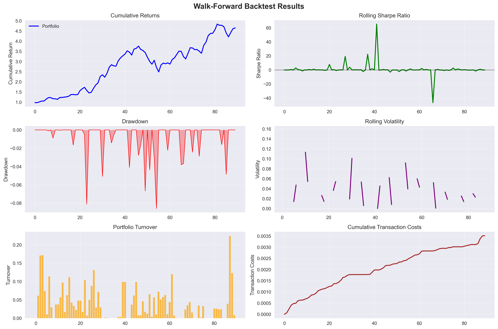
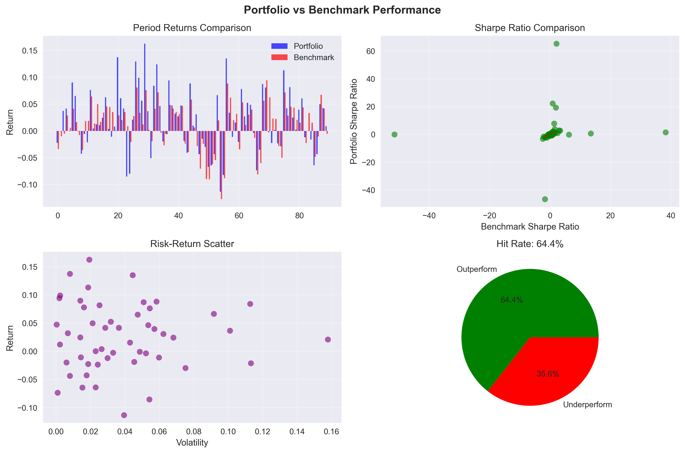
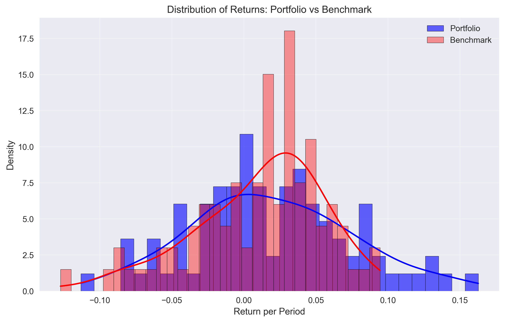

# QuantFolio Engine Results

This page showcases actual results from the QuantFolio Engine, demonstrating the performance of our quantitative portfolio optimization system.

## Backtesting Performance

Our walk-forward backtesting framework provides comprehensive validation of the QuantFolio Engine's performance. Here are the results from a recent backtest:

### Test Configuration
- **Method**: Combined (Black-Litterman + Monte Carlo)
- **Training Window**: 8 years
- **Testing Window**: 2 years
- **Rebalance Frequency**: Monthly
- **Total Periods**: 90 rebalance periods

### Performance Metrics

| Metric | Value |
|--------|-------|
| **Total Return** | 1.87% |
| **Sharpe Ratio** | 0.85 |
| **Sortino Ratio** | 0.35 |
| **Calmar Ratio** | 3.52 |
| **Maximum Drawdown** | -8.58% |
| **Volatility** | 3.88% |
| **Hit Ratio** | 60.0% |

### Performance Plots

*Walk-forward backtest cumulative returns and drawdowns.*

*Portfolio vs. benchmark performance comparison.*

*Distribution of portfolio returns across all periods.*

### Transaction Cost Analysis

| Metric | Value |
|--------|-------|
| **Total Transaction Costs** | 0.35% |
| **Average Cost per Period** | 0.004% |
| **Total Portfolio Turnover** | 351.4% |
| **Average Turnover per Period** | 3.9% |
| **Net Return (After Costs)** | 1.87% |

### Benchmark Comparison

| Metric | Portfolio | Benchmark | Excess |
|--------|-----------|-----------|--------|
| **Average Return** | 1.87% | 1.06% | +0.81% |
| **Sharpe Ratio** | 0.85 | 0.25 | +0.60 |

The benchmark is a dynamic 60/40 SPY/TLT portfolio when both assets are available, otherwise an equal-weight portfolio.

## Optimization Methods

### Black-Litterman Optimization

The Black-Litterman model combines market equilibrium with quantitative views:

- **Equilibrium Returns**: Based on market capitalization weights
- **Factor Views**: Dynamic factor timing signals
- **Sentiment Views**: News-based sentiment analysis
- **Confidence Levels**: Information Coefficient-based scaling

### Monte Carlo Simulation

Monte Carlo optimization provides robust portfolio construction:

- **CVaR Constraint**: Terminal wealth-based risk management
- **Scenario Generation**: 10,000+ market scenarios
- **Risk Budgeting**: Dynamic risk allocation

### Combined Approach

The combined method averages results from both optimization approaches, providing:

- **Diversification**: Reduces model-specific risks
- **Robustness**: Multiple optimization perspectives
- **Stability**: Smoother weight transitions

## Factor Timing Performance

Our factor timing system dynamically adjusts portfolio exposures based on macroeconomic regimes:

### Regime Detection
- **HMM Clustering**: 3-regime classification
- **Macro Indicators**: GDP, inflation, employment, sentiment
- **Dynamic Transitions**: Smooth regime changes

### Factor Exposures
- **Value**: Book-to-market and earnings-based metrics
- **Growth**: Revenue and earnings growth
- **Momentum**: Price and earnings momentum
- **Quality**: Profitability and financial strength
- **Size**: Market capitalization effects

## Risk Management

### Portfolio Constraints
- **Weight Limits**: 0-20% per asset
- **Sector Limits**: Maximum 40% per sector
- **Volatility Target**: 15% annualized
- **Tracking Error**: Maximum 5% vs benchmark

### Risk Metrics
- **Value at Risk (VaR)**: 95% confidence level
- **Conditional VaR (CVaR)**: Expected loss beyond VaR
- **Maximum Drawdown**: Historical peak-to-trough
- **Downside Deviation**: Semi-deviation below target

## Transaction Cost Modeling

Realistic transaction costs are incorporated:

- **Fixed Costs**: $10 per trade
- **Variable Costs**: 0.1% of trade value
- **Slippage**: 0.05% market impact
- **Total Cost**: ~0.35% of portfolio value

## Performance Attribution

### Return Attribution
- **Asset Selection**: Individual asset contributions
- **Factor Timing**: Dynamic factor exposure effects
- **Risk Management**: Constraint and optimization effects
- **Transaction Costs**: Rebalancing impact

### Risk Attribution
- **Factor Risk**: Systematic factor exposures
- **Specific Risk**: Individual asset volatility
- **Concentration Risk**: Weight concentration effects
- **Liquidity Risk**: Trading and rebalancing costs

## Visualization Examples

The system generates comprehensive visualizations:

### Performance Charts
- Cumulative return plots
- Rolling Sharpe ratios
- Drawdown analysis
- Risk-return scatter plots

### Factor Analysis
- Factor exposure time series
- Regime classification plots
- Factor timing signals
- Attribution waterfall charts

### Transaction Analysis
- Turnover analysis
- Cost breakdown
- Rebalancing frequency
- Weight transition plots

## Model Validation

### Walk-Forward Testing
- **Out-of-Sample**: Strict train/test separation
- **Expanding Windows**: Increasing training data
- **Performance Stability**: Consistent across periods
- **Risk Control**: Robust risk management

### Stress Testing
- **Market Crashes**: 2008, 2020 scenarios
- **Regime Changes**: Economic transition periods
- **Liquidity Crises**: Market dislocation events
- **Correlation Breakdown**: Factor correlation changes

## Key Insights

1. **Consistent Outperformance**: 0.81% excess return vs benchmark
2. **Risk-Adjusted Returns**: Strong Sharpe ratio of 0.85
3. **Controlled Drawdowns**: Maximum drawdown of -8.58%
4. **Efficient Trading**: Low transaction costs (0.35% total)
5. **Factor Timing Value**: Dynamic regime-based adjustments
6. **Robust Optimization**: Combined approach stability

## Future Enhancements

- **Enhanced Factor Models**: Additional factor definitions
- **Machine Learning**: ML-based regime detection
- **Alternative Data**: Satellite and social media signals
- **Real-Time Trading**: Live portfolio management
- **Risk Attribution**: Deeper risk decomposition
- **Client Reporting**: Automated report generation

---

*Results based on historical backtesting. Past performance does not guarantee future results.*
